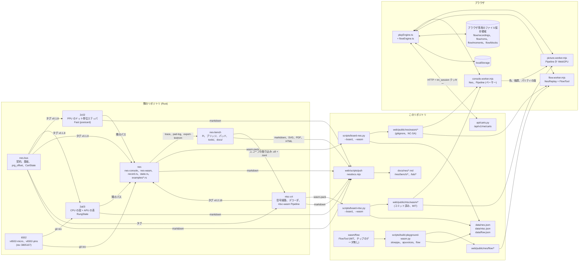
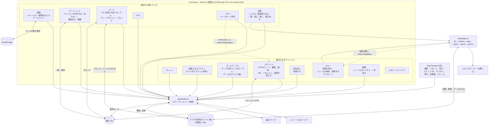
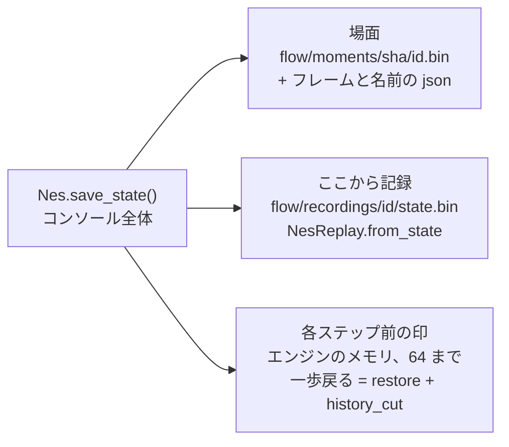
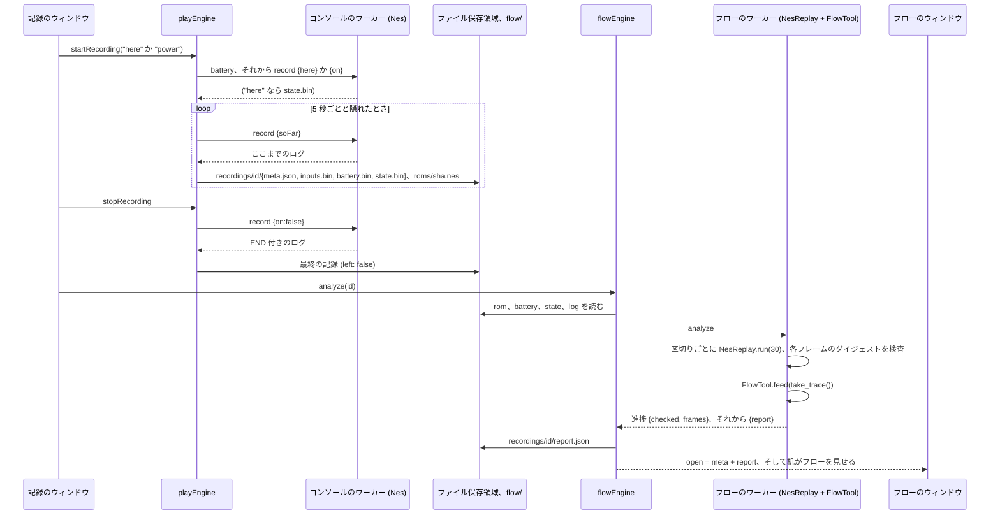
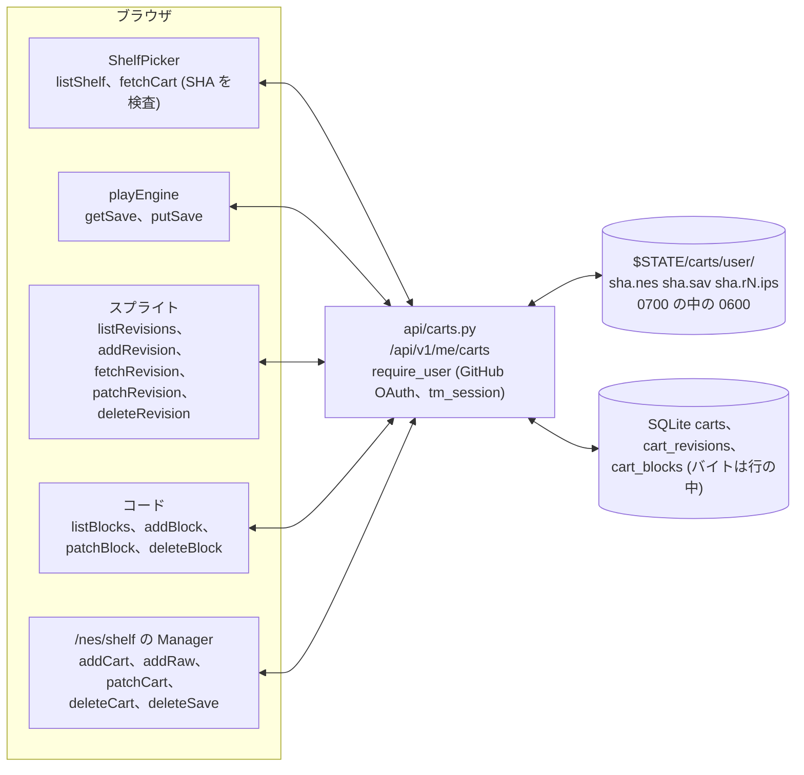
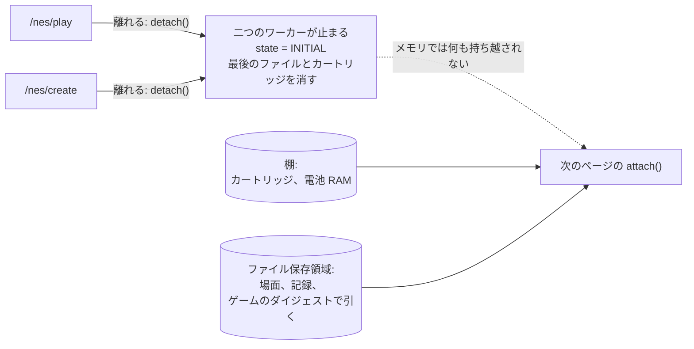

# 机の竣工図

*作る机の版 1、2026-09-28 時点のコードから読み取った: このサイトは
8e86ee7、nes ffa239e、nes-bus 707485a、2a03 a7fa5f5、2c02 c9fe9e8、
ntsc-crt f91aecb、nes-bench 83f9175。ここにある主張はすべてファイルの中で
読んだもので、記憶から書いたものではない。ファイル自身のコメントがその
コードと食い違っていた所は同じ晩に直し、最後の節にその結果をまとめた。*

机は [/nes/create](/ja/nes/create) だ: 遊ぶページのコンソールと、走っている
ゲームの中を覗くために私たちが持っている道具のすべてを、それぞれ一つの
ウィンドウにして並べたもの。このページは、机の使い勝手を作り直す間ずっと
開いておくための地図だ。ウィンドウごとに、何を読み、何をし、作ったものが
どこへ行き、ほかのどの部品に頼っているかを書いてある。図はどれも押すと
全画面で開き、下の説明文がその図の示すものを言う。報告書の作業用の言葉は
[報告書が使う言葉](/ja/docs/words)で説明してあり、机自身の言葉はこの
ページの終わりにある。

## 手短に

- **一台の機械、たくさんの見方。** [/nes/play](/ja/nes/play) と
  [/nes/create](/ja/nes/create) の上のすべてが、一つのモジュール
  `playEngine.ts` に従う。これが二つのワーカーを持つ: コンソール（WebAssembly
  になった NES）と、絵（NTSC の信号経路。ブラウザが GPU を差し出し、その
  デコードが一致するなら GPU で、そうでなければ WebAssembly で）。どの
  ウィンドウもエンジンの一つのスナップショットを購読し、その動詞を呼ぶ。
  ワーカーに直接話すウィンドウは無い。
- **三つ目のワーカーは、フローの道具のために仕事ごとに。** `flowEngine.ts`
  は記録を再生してその再生のトレースをフロー解析器に流すワーカーを起こし、
  終わればそのワーカーを捨てる。
- **物が残る場所は四つで、それ以外に無い。** ブラウザ専用のファイル保存
  領域が、記録とその報告、ゲームごとの一部のコピー、場面、そしてディスク
  から来たカートリッジのコードブロックを持つ。ブラウザのローカルストレージ
  が、机の配置とタッチパッドの置き場所を持つ。GitHub のサインインの向こうの
  棚が、カートリッジ、カートリッジごとに一つの電池セーブ、パッチとしての
  スプライトのリビジョン、そして棚から来たカートリッジのコードブロックを
  持つ。それ以外のすべて、ブレークポイント、履歴のトレース、一歩戻るための
  印は、メモリにあってページと一緒に消える。
- **遊ぶと作るの間に、生きたままの受け渡しは無い。** 両方のページが同じ
  エンジンを読み込むが、ページを離れるとエンジンは切り離される: 二つの
  ワーカーが止まり、状態は初期に戻る。持ち越されるのは保存されたものだ:
  棚のカートリッジとその電池 RAM、そしてファイル保存領域の場面と記録。
  これらはゲームのダイジェストで引かれるので、同じゲームをまた見つける。

## 七つのリポジトリ、一つのページ



コンソールは Rust のクレートの一族だ。`nes-bus` が共有する契約を持つ:
ドットのフレーム、ピンのフレーム、基板を持ったカートリッジ。`2a03` は
CPU と音のチップ、`2c02` は絵のチップで、どちらもトランジスタレベルの
チップから組まれ、それに対して検査されている。`ntsc-crt` はコンソールと
テレビの間の信号だ。`nes` はチップを一枚の基板に載せ、`nes-wasm` で
コンソール全体をブラウザ向けに詰める。`nes-bench` はベンチの上の実機と
そのブリッジとパッド、そしていま読んでいるこのノートだ。クレートは git
のタグか隣のパスで互いに届く。サイトがそれらに届くのは、ビルドして何を
ビルドしたかを記録する三つのスクリプトと、文書を引いてくる一つを通して
だけだ。

この図が見えるようにしている三つのこと:

- **コンソールのバンドルはコミットされず、信号経路のはされる。**
  `web/public/nes/wasm/` のコンソールのバンドルはダイのデータから派生して
  いて、その NonCommercial ShareAlike のライセンスと一緒に旅をする。だから
  ホストの上で `board-nes.py` がビルドし、gitignore に入っている。信号経路の
  バンドルはチップのデータを含まず、コミットされている。`wasm/flow` の
  フロー解析器は私たちのもので、MIT、読むのはトレースだけだ。
- **絵のバンドルはコンソールのピン留めに合わせてある。** コンソールは
  `ntsc-crt` をタグでピン留めしていて（執筆時点で v0.2.18）、サイトが出す
  信号経路のバンドルはそのタグで記録したものだ（`data/ntsc.json` の
  `bundle`）。デプロイの最初の段のライブラリテスト二本がそこに留める: 一本は
  タグがコンソールのピン留めと違うバンドルを出すことを断り、もう一本は出す
  ファイルを記録のダイジェストに合わせる。2026-09-29 まで、出していた
  バンドルはピン留めより六つ後ろのタグで、それを言うものが無かった。
- **API が知っているのはカートリッジ、セーブ、リビジョン、コードブロック
  で、それ以外を知らない。** 場面、記録、報告はサーバに届かない。コード
  ブロックが届くのは棚から来たカートリッジのものだけで、行き先はゲームが
  すでにあるその棚だけだ。

### 各リポジトリがページに渡すもの

| から | へ | 何を、どんな形で |
|---|---|---|
| nes-bus | 2a03、2c02、nes、ntsc-crt | git のタグで Rust の型: `DotFrame`、ピンのフレーム、`prg_offset` と `CartState` を持つ `Cartridge` |
| 6502 | 2a03、nes | 一つの git リビジョンの `v6502-micro` と `v6502-pins`、`board-nes.py` が突き合わせる |
| 2a03、2c02 | nes | 隣のパスでクレート。ビルド時に実測するダイのデータの表。保存状態 `RungState` と `Fast` |
| ntsc-crt | nes、2c02 | タグでクレート |
| nes | サイト | `board-nes.py --wasm` による `nes_wasm.js` とその `.wasm`（gitignore）。テスト ROM `bars`、`pad`、`pad-dmc`。`data/nes.json` の数字。ビルドの検査が押さえるダイジェスト |
| ntsc-crt | サイト | `board-ntsc.py --wasm` による `ntsc_wasm.js` とその `.wasm`（コミット済み）。`data/ntsc.json` |
| wasm/flow（ここ） | サイト | `build-playground-wasm.py` による `flow.js` と `flow_bg.wasm`。`data/flow.json` |
| nes の examples | nes-bench | `xray.py` と `dissect.py` が読む `trace` の出力（`.pins`、`.stim`、`.events.json`、`.overlay`）。`compare-logs.py` 向けの `pad-log` とベンチ台本の出力 |
| nes-bench | ntsc-crt、nes | スコープの取り込み（`.u8` と `.toml`） |
| 隣のすべて | サイト | `pull-nesdocs.mjs` を通した markdown。nes-bench からはさらに SVG のシート、製造用ファイル、図面のパッケージ、ラボの写真、そして `/lab/pad-keydown` のキー押下ページ |

## 机そのもの



### 机の動き方

ウィンドウは帯をつかんで動かし、角を引いて大きさを変え、どこかを押すと
前に出て、帯をダブルクリックすると机いっぱいに広がり、帯から閉じる。机の
上のトレイが閉じたウィンドウをまた開け、「整える」がすべてのウィンドウを
最初の位置に戻す。ウィンドウの名前はその中身自身の見出しで、マウントの後に
読まれる。だからパネルの名前は一か所にあり、トレイがそれに従う。並べ方は
このブラウザに一つのキー `tm.nes.create.desk` で残る。ピクセル単位、丸め
なし、ウィンドウごとに一レコード（`lib/desk.ts`）:

```ts
type Win = { x: number; y: number; w: number; h: number; z: number; open: boolean; max: boolean };
// stored as { v: 2, wins: Record<string, Win> }, keyed by the window's id
```

版は 2。これを上げると保存された配置がすべて捨てられる。2026-09-27 に
「記録」がすべての机で開いた状態になったのはこれによる。「整える」はこの
キーを消す。ウィンドウを名指す URL のハッシュ、たとえば `#record` は、その
ウィンドウを開いて前に出す。帯の「記録」リンクはこうして机に着く。

スマートフォン、あるいは幅 64rem 未満か高さ 36rem 未満のどんな表示領域にも
机は無い: 同じウィンドウが自分の見出しを持って縦に並び、バーの下の帯が
遊ぶページと同じようにそれらへの道になる。どちらでも一つのツリーなので、
境界をまたいでも何も動かない。ウィンドウの中身はアンマウントされず、
閉じたウィンドウは取り除かれるのではなく隠れる。画面のキャンバスは
コンソールが描く先で、新しいキャンバスはコンソールを止めてしまうからだ。

### ウィンドウの最初の位置

| 最初から開いている | 頼まれるまでトレイに |
|---|---|
| 画面（左上）、カートリッジ（その下）、コード（中央の列）、CPU とメモリ（右上）、記録（右下） | パレット、画面上のスプライト、ネームテーブル、スプライト、読み出し、フロー（報告が届くと画面とコードの上に開く）、履歴、このページについて |

「記録」が最初から開いているのは、フローの道具への入口がトレイではなく
机の上にあるようにだ（オーナーの判断、2026-09-27）。

## ウィンドウごとに: 何を受け取り、何を作り、何を保存するか

エンジンは一つのスナップショットを公開する。ウィンドウは必要なフィールドを
読み、エンジンの動詞を呼ぶ。以下の「エンジンの状態」はスナップショットの
フィールドのこと。各動詞の裏のワーカーのパスは次の節にある。

| ウィンドウ | 受け取る | 作る（動詞） | 保存する | 備考 |
|---|---|---|---|---|
| **画面** | 絵のワーカーのビットマップ。エンジンがキャンバスに描く | `attach`、`detach`。ゲームパッドの `setTouchPad(bits)`。キーはエンジンが受ける | パッドの向きごとの置き場所と振動、localStorage の `tm.nes.pad*` | ゲームパッドが出るのは机が縦積みになるとき（スマートフォン）だけ。画面外の入力欄がフォーカスを持ち、スマートフォンが矢印を渡す |
| **カートリッジ** | `loaded`、`powered`、`running`、`battery`、`why` | ディスクか棚からの `load(file, cart?)`。`toggleRun` | 電池 RAM を棚へ。タイマーで、一時停止で、隠れたときに、そして次の読み込みの前に。読み込みで戻す | **場面**を含む |
| **場面**（カートリッジの中） | ゲームの SHA-256、`momentsKept` | `saveMoment`、`loadMoment`、`deleteMoment` | ファイル保存領域、`flow/moments/<sha>/<id>.bin` と `.json` | 場面はコンソール全体（nes-console の `state.rs`）とそのフレーム数。記録中は読み込みが無効 |
| **コード** | `machine.code`、`codeAt`、`cpu.pc`、`breakpoints`、`stoppedAt`、`cart`、ゲームの SHA-256。6502 サイト自身の表で逆アセンブルする | `toggleBreakpoint`、`clearBreakpoints`。取り込んだブロックとそのラベルとメモ | ブレークポイント: エンジンのメモリ、毎ティックに送られる。ブロック: 棚から来たカートリッジなら棚へ、ディスクから来たなら ファイル保存領域のゲームのダイジェストの下（`flow/blocks/<sha>/<id>.json`）へ。どちらも取り込んだままで残し、言葉は欄を離れたときに。markdown か JSON のダウンロードとして書き出す | ブロックは残した所からカートリッジと一緒に戻る。ファイル保存領域の無いブラウザだけがディスクのカートリッジのブロックをページに留め、ウィンドウがそう言う |
| **CPU、メモリ、パレット、画面上のスプライト**（一つのコンポーネント、`State.tsx`） | `machine`（走行中は 200 ms ごとに公開）、`palette`（実測した色） | メモリ: `watch(page)`。画面上のスプライト: タイルのボタンがそのタイルをスプライトに渡す | 無し | 四つのウィンドウ、一人の読み手 |
| **ネームテーブル** | ネームテーブル RAM と、基板のバンクを通して画像チップが見ているパターンメモリ。ウィンドウが見えている間、機械が公開されるたびにワーカーへ尋ねる（`nametables`）。パターンテーブルのための `ppu.ctrl`、パレット RAM と実測した色、ヘッダのミラーリングのための `rom` | 何も | 無し | 二つのテーブルをチップが持つままに描く。タイルはその瞬間にチップが見ているもので、基板が何をバンク切り替えしていても変わらない |
| **スプライト** | `base`（解釈した iNES イメージ）、`rom`、`patched`、`palette`、`machine.palette`（生きた値）、`cart`。CHR-RAM から描く基板では、コンソールのパターンメモリ（`patternMemory`）をシートが見えている間、公開のたびに尋ねる | 適用（`reloadWith(image)`）、戻す、`.ips` か `.patched.nes` のダウンロード。リビジョンを残す、説明を変える、読み込む、削除する | 編集: メモリの Map。リビジョン: 棚へ、メッセージ付きの IPS として | バイトを変える唯一のウィンドウ。CHR-RAM の基板では見せるだけ |
| **読み出し** | フレーム数、デコードされなかった数、フレームごとのコスト、経路、一致、fps、ドリフト、アンダーラン、電池 | 何も | 無し | 読むだけ |
| **記録** | 遊ぶ側: `loaded`、`recording`、`powered`、`framesRun`、`recordingsKept`。フロー側: `list`、`busy`、`open`、`why` | `startRecording("here" か "power")`、`stopRecording`。記録ごとに `analyze`（読む）、`open`、`exportOne`（`.nesrec`）、`remove`、`cancel`、`giveRom`、`importOne` | ファイル保存領域の記録。記録中は 5 秒ごとと隠れたときにコピー | フローの道具への入口。最初から机の上に開いている |
| **フロー** | `flow.snapshot().open`（記録のメタとその解釈済みの報告） | 見方（概要、モード、ルーチン、ループ、テーブル、パッド、変数、生）。`saveTrace(from, to)` を `.trace` として。`downloadReport` を `.flow.json` として | 新しいものは無し。報告はすでにファイル保存領域にある | 報告が開くと前に出る |
| **履歴** | `history`、`running`、`moves`、`backDepth`、`machine.code`。一時停止中はトレースのバイトを読んで解釈する（`lib/history.ts`） | `setHistory(on)`、`stepBack` | トレースと戻るためのスタックはエンジンのメモリに（トレースの最新 1 メビバイト。印は 64） | 一歩戻ると、各ステップの前に保存した場面を戻し、履歴をそこまで切る |
| **PlayTransport**（床） | `powered`、`running`、`loaded` | `setPower`、`reset`、`toggleRun`。作るページではさらに `step(half, cycle, op, line)` と `stepFrame` | 無し | 速さとシークは常に無効で、理由がその title にある |

このうちいくつかは、一つの欄より一文ぶん多く言う値がある。

**画面**はキャンバスに付いたコンソールだ。絵のワーカーが送るビットマップを
エンジンが描く。ウィンドウ自身が持つのはキャンバスと、机が縦積みになった
ときのタッチパッドだけだ。キーはエンジンがドキュメントで読むので、どの
ウィンドウにフォーカスがあってもパッドは働く。

**カートリッジ**はゲームの入口だ: ディスクのファイルか、棚のカートリッジ。
電池の行も持ち、基板に電池 RAM があるか、最後にいつ残したかを言う。その
下に場面の一覧がある。電池 RAM は、電池付きのカートリッジが走っている間は
タイマーで、コンソールが一時停止したとき、ページが隠れたとき、そして次の
読み込みの前に棚へ行き、読み込みで戻ってくる。ディスクから来たカートリッジ
の電池はページの間だけ残る。

**コード**はプログラムカウンタからのバスで、前へ逆アセンブルし、PC の所を
照らす。ブレークポイントはエンジンに住み、毎ティックと一緒に旅をするので、
コンソールはページに尋ねずにそこで止まる。ブロックとは、読み手が選び、
ラベルとメモを付けたリストの一区間だ。カートリッジのダイジェスト、範囲、
バイト、テキストを運ぶので、百科事典自身の形でも JSON でも外へ出られる。
棚から来たカートリッジのブロックはそこにリビジョンと並べて残り、バイトも
一緒で、そのカートリッジをまた棚から読み込むと戻ってくる。ディスクから
来たカートリッジのブロックはブラウザのファイル保存領域に、ゲームの場面と
並んでそのダイジェストの下に残り、同じファイルをまた読み込むと戻ってくる。

**ネームテーブル**は絵のチップ自身のネームテーブル RAM 2 キロバイトで、
チップが持つ二つのテーブルとして描く。タイルは制御レジスタが名指す
パターンテーブルからゲームのものを使い、背景パレットは四つ。基板の
ミラーリングが、どの PPU アドレスがどのテーブルに載るかを決める:
ミラーリングがはんだで決まっている基板ならヘッダがそれを言い、基板が
切り替える場合はウィンドウがそう言う。タイルはその瞬間にチップが見ている
パターンメモリだ: コンソールが基板のバンクをいまある通りに通して読み、
一バイトごとに基板の状態を戻す。読むこと自体に副作用を持つ基板が一つある
からだ（MMC2 のラッチは引き金のタイルで動く）。だからピクチャ ROM を
バンク切り替えする基板も、ファイルの最初のバンクではなくバスに載っている
バンクで描く。

**スプライト**はバイトを変える唯一のウィンドウだ。編集とは、元のイメージに
対する一つのタイルの新しい 16 バイトのこと。その集まりはパッチ済みイメージ
としてコンソールに入れられ（元は元のままなので、変更は電源の切り入れを
越えて残る）、IPS パッチかパッチ済みイメージ全体として外へ出られ、棚から
来たカートリッジならメッセージ付きのリビジョンとしてそこに残せる。CHR-RAM
から描く基板ではファイルにタイルが無いので、シートはゲームが描いたままの
コンソールのパターンメモリを、機械に従って見せ、何も変えない: パッチする
元が無いからだ。

**記録**、**フロー**、**履歴**は机自身の道具で、次の節がそれらの作るものを
追う。

## ページと機械の間の継ぎ目

ページはコンソールのワーカーと、要求と応答の橋で話す: `{id, path, ...}` が
入り、`{id, ok, answer}` が出る。すべてのパス、誰が呼ぶか、そして裏の
WebAssembly（nes-wasm の `Nes`）:

| パス | 呼ぶもの | wasm | 使うもの |
|---|---|---|---|
| `load` | `load`、電源投入、`reloadWith`、記録（電源投入から） | `new Nes(bytes)` | カートリッジ、スプライト、記録 |
| `tick`（dt、pad、pad2、breakpoints） | ループ | `pacer.tick`、`run_frames`、`run_frames_until`、`frames_done` | 画面、コード |
| `state` | `refreshMachine` | `cpu_state`、`ppu_state`、`palette`、`oam`、`peek` | CPU、メモリ、パレット、画面上のスプライト、コード |
| `watch` | `watch` | `peek` | メモリ |
| `step`（kind） | `step` | `step_half_cycles`、`step_instruction`、`step_scanline` | 操作帯（作る） |
| `frame` | `stepFrame` | `run_frames(1)` | 操作帯（作る） |
| `reset`、`off` | `reset`、`setPower(false)` | `reset`。記録中なら `record_stop` | 操作帯 |
| `battery` | `saveNow`、`load`、`startRecording` | `battery_ram`、`set_battery_ram`、`has_battery` | カートリッジ、記録 |
| `save`、`restore` | `saveMoment`、`loadMoment`、`stepBack` | `save_state`、`load_state` | 場面、履歴 |
| `record`（here、soFar、on、off） | `startRecording`、`keepSoFar`、`stopRecording`、`detach` | `record_start_here`、`record_so_far`、`record_start`、`record_stop` | 記録 |
| `history`、`historyRead`、`mark`、`historyCut` | `setHistory`、`readHistoryBytes`、`markBack`、`stepBack` | `set_history`、`history`、`history_end`、`save_state`、`history_cut` | 履歴 |
| `ciram` | `nametables`、`patternMemory` | `ciram`、`chr` | ネームテーブル、スプライト |

飛んでいるティックは常に一つなので、表示のコールバックが報告する時間は
その前の一つの本当のコストだ。ティックが何フレーム負うかを決めるドリフト
の方針は信号経路自身の `Pipeline` で、ここではフレームを一つも押さない
ペーサーとして使う。だから規則はリポジトリのもので、言い直されることは
ない。`load` はコンソールが持つ基板、執筆時点で七つのどれかの上にバイトから
コンソールを組み、それ以外は名指しで断る。ゲームはブラウザから出ない。

絵のワーカーは `frame`（最新フレームの色、強調、パリティの面）を受け取り、
ビットマップと、どの経路が描いたか、そして一致の数字を返す。その `palette`
パスは、このワーカーが実測した 64 色を返し、パレットとスプライトはそれで
塗る。絵が忙しい間にコンソールが作ったフレームは次のもので置き換えられ、
デコードされなかった数に数えられる。だからコンソールは絵を待たず、音が絵の
ために止まることもない。

フローのワーカーは `analyze`（ゲーム、電池 RAM、保存状態、入力ログ、
プログラムの長さ）と `trace`（同じものにフレーム範囲を付け、320 枚を上限
に）を受け取る。

## 一つの保存状態、三つの使い方

`save_state` はゲームの 8 バイトのダイジェストに続けてコンソール全体を返す:
マジック（`TMNESSTA`）、版、それから CPU、PPU、基板、カートリッジの
レジスタと RAM、タイミング、音。`load_state` は別のゲームの状態を断り、記録
中も断る。同じバイトが机の上では三つのものになる:



## 記録、端から端まで



ここを渡る形式はコンソールのもので、nes リポジトリの `record.rs` に一度
定義され、ブラウザに写されている:

- **入力ログ**、一イベント 16 バイト（パッドの変化、リセット、フレームの
  ダイジェスト、終わり）。マスタークロックが一致したときに適用される。ログ
  が記録の全部だ。コンソールは電源投入から決定的で、同じバイトと同じ押し方
  は同じフレームを出し、再生時にダイジェストがそれを証明するからだ。
- **トレース**、一レコード 8 バイト（プログラムオフセット付きの CPU
  サイクル、各オペコード取り出しの後のレジスタ、入力、フレーム）。フロー
  解析器が読み、履歴が解釈する（`lib/history.ts`）。
- **報告**、`FlowTool.report()` の JSON: プログラムオフセットで引く
  サイト、種類ごとのルーチン、ループ、変数、ディスパッチテーブル、モード、
  パッドに続いたもの、そしてフレームごとの時系列。`flowEngine.ts` が対応
  する TypeScript の型を持つ。
- **書き出し**、`.nesrec`: マジック、それから長さ付きのメタ、電池、ログ、
  状態。ゲームは決して含まない。ゲームが無い記録はそれを求め（記録の
  「ROM を渡す」、ディスクか棚から）、ダイジェストを検査する。

ゲームのいまの場面から始めた記録は、その瞬間に保存したコンソール全体から
始まり、その保存はログの隣に `state.bin` として残る。再生はまずその状態を
読み込み（`NesReplay.from_state`）、それからログを適用する。

## 棚



上限は API のもので、その定数と環境から読む: 名前は 80 文字、メモは 240。
電池セーブは 32 KiB。カートリッジごとにリビジョン 16。カートリッジごとに
コードブロック 64、一つ 4 KiB まで。カートリッジはヘッダとトレーナーを別に
4 MiB。アカウントごとに 32 枠で、管理者が枠を変え、0 で閉じる。リビジョン
は元のイメージに対する IPS パッチで、パッチ済みイメージは求められたときに
組まれ、決して保存されない。ブロックはその範囲と、バスに載っていたバイトと、
二つの文字列だ。そのリストは見せる所ごとにバイトから逆アセンブルし、決して
保存しない。ウィンドウのイベント `tm:shelf-changed` が、書き込みの後に
すべてのピッカーを更新する。

## 何がどこに残り、何が生き延びるか

| どこ | 何 | 引く鍵 | 再読み込みを越える | ページを離れても | 別のブラウザ、別の機械 |
|---|---|---|---|---|---|
| ブラウザ専用のファイル保存領域 | 記録とその報告、ゲームごとに一部のコピー、場面、ディスクから来たカートリッジのコードブロック | 記録の id。ゲームの SHA-256 | はい | はい | いいえ: このブラウザだけで、サイトのデータを消すと無くなる |
| localStorage | 机の配置、タッチパッドの置き場所と振動 | 固定のキー | はい | はい | いいえ |
| 棚、GitHub でサインインして | カートリッジ、カートリッジごとに一つの電池セーブ、IPS としてのスプライトのリビジョン、コードブロック | アカウントとカートリッジの id | はい | はい | はい、サインインすれば |
| メモリ | ブレークポイント、履歴のトレース、一歩戻るための 64 の印 | 何も | いいえ | いいえ | いいえ |

机を作り直す人への結論が二つ。ゲームの場面、記録、そして（ディスクから
なら）コードブロックはすでにそのダイジェストで引かれているので、「この
ゲームについて持っているもの」はゲームを読み込んだ瞬間に、どちらのページ
でも見せられる。そして 2026-09-29 からは、机の上で書かれたものはすべて
どこかに残る。コードブロックの住まいは二つ、棚から来たカートリッジなら棚、
ディスクから来たならファイル保存領域で、ブロックがその間を渡ることは無い。
どちらも、読んだカートリッジで引かれるからだ。

## ページを離れる



切り離しは、記録が走っていればそれを止め（`record_stop`）、二つのワーカー
を止め、エンジンを最初の状態に戻して最後のファイルとカートリッジを消す。
何も告げないのは、聞いているのがページと一緒に消える節だけで、次の attach
は新しいスナップショットから始まるからだ。記録、フロー、履歴は作るページ
にだけあり、遊ぶページのエンジンはそれらの状態を運ぶが決して使わない。

## 境界を渡るもの

| から | へ | 何を、どうやって |
|---|---|---|
| コンソールのワーカー | 絵のワーカー | 色、強調、パリティの面。戻りはビットマップ |
| コンソールのワーカー | ファイル保存領域 | 入力ログ、保存状態、電池 RAM |
| フローのワーカー | ファイル保存領域 | 報告の JSON |
| ページ | API | セッションクッキー付きの HTTP: ゲームのバイト、`.sav`、IPS、コードブロック（その範囲、バイト、言葉） |
| エンジン | localStorage | 机の配置。パッドの置き場所 |
| 机 | ダウンロード | markdown か JSON のブロック。`.nesrec` の記録。トレース。報告。IPS かパッチ済みイメージ |

この表に無いものは何も渡らない。とくに、キーもトレースもサーバには届か
ない。コードブロックが届くのは棚から来たカートリッジのものだけで、行き先は
その棚だけ。ゲームのバイトが上がる先は読み手自身の棚だけだ。

## 調査がコードの裏に見つけたもの

すべてのウィンドウをそれ自身のコメントと突き合わせて読むと、言葉がコード
に遅れている所が十一か所あった。どれも振る舞いではなく、以前の机に対して
書かれたコメントか一行のコピーだった。十一か所すべてを 2026-09-28 に直し、
その一覧を、システム自身の言葉を調べると何が見つかるかの記録としてここに
残す:

1. 作るページの説明文は、場面はまだ単独で保存できず、ブレークポイントは
   まだ無いと言っていた。どちらも机の上にあった。
2. 操作帯のシークの title は何も巻き戻せないと言っていた。履歴が一歩ずつ
   戻る。
3. スプライトのヘッダは、このバンドルからはパレット RAM を読めないと言って
   いた。コンポーネントは読んでいる。
4. コンソールのワーカーのヘッダは、答える十六のパスのうち三つを挙げ、記録
   は電源投入からしか始められないと言っていた。ゲームの途中から始められる。
   その `ciram` パスには呼び手が無かった（2026-09-29 からはある: ネーム
   テーブルのウィンドウ）。
5. 絵のワーカーのヘッダは `palette` パスを落としていた。
6. ファイル保存領域のヘッダは `state.bin` と場面を落としていた。
7. 記録のヘッダは「電源投入から」しか言っていなかった。
8. `shelf.patchRevision` には呼び手が無かった（2026-09-29 からはある:
   スプライトの「説明を変える」）。
9. `detach()` は聞き手に告げずにエンジンの状態を戻す。上に書いた理由で
   害は無く、いまはそう書いてある。
10. `lib/nes-shelves.ts` はノートの文書の棚で、カートリッジの棚ではない。
    どちらのファイルも、いまは自分がどちらかを言う。
11. 記録、フロー、履歴は作るページにだけあり、遊ぶページのエンジンはその
    状態を運ぶ。エンジンのヘッダはいまそう言う。

## 調査が無いと見つけたもの、そして届いたもの

2026-09-28 の調査は、机に無いものを四つ見つけた。四つとも 2026-09-29 に
届き、この文書の残りはそれらが載った机を書いている:

- **コードブロックが残る。** 棚から来たカートリッジのものは、ウィンドウ
  自身がそうあるべきと言っていたとおり、棚のリビジョンの隣に行き、
  カートリッジと一緒に戻ってくる。ディスクから来たカートリッジのブロックは
  ブラウザのファイル保存領域に、ゲームの場面と並んでそのダイジェストの下に
  行き、同じファイルをまた読み込むと戻ってくる。その領域の無いブラウザだけ
  がページに留め、ウィンドウがそう言う。
- **ネームテーブルにウィンドウができた。** ネームテーブルは、呼び手の
  無かったコンソールのワーカーの `ciram` パスに尋ね、チップが持つ二つの
  テーブルを描く。
- **リビジョンの説明を言い直せる。** スプライトの「説明を変える」が、どの
  ウィンドウも呼んでいなかった `shelf.patchRevision` を呼ぶ。
- **絵のバンドルがコンソールのピン留めに合った。** コンソールが名指す
  タグで記録し、デプロイのライブラリテストが別のタグのバンドルを出すことを
  断る。

## 使い勝手の仕事にとってこれが意味すること

作り直しが頼れる事実。見た目ではなく構造だから:

- **どのウィンドウも一つのスナップショットの見方だ。** ウィンドウを動かし、
  まとめ、分けてもエンジンには何の費用も無い。新しいウィンドウは、すでに
  公開されているフィールドの新しい読み手だ。机がウィンドウごとに持つ状態は
  その長方形だけ。
- **机自身の保存は一つのキーだ。** 配置は `tm.nes.create.desk` の下の
  `{v, wins}`、ピクセル単位。版を上げると捨てられ、「整える」が消す。URL の
  ハッシュがウィンドウを開いて前に出す。
- **住まいを待っているものは無い。** 調査が待っていると見つけた三つ
  （React の状態にあるコードブロック、見せる場所の無い `ciram` の
  エクスポート、呼び手の無い `patchRevision`）には 2026-09-29 からそれぞれ
  ある: 棚、ネームテーブルのウィンドウ、スプライトの「説明を変える」。
- **三つのものはすでにゲームのダイジェストで引かれている**ので、遊ぶから
  作るへ、また戻ってもゲームについてくる: 場面、記録、そしてディスクから
  来たカートリッジのコードブロックだ。「このゲームについて持っているもの」
  を見せる設計には、索引がすでにある。
- **バイトが変わるのはスプライトだけだ。** ほかのすべてのウィンドウは読む。
  机全体の「編集済み」の状態とは、スプライトの編集の Map とエンジンの
  `patched` フラグで、それ以上ではない。

## 机の言葉

- **場面**: ある一瞬に保存したコンソール全体。フレーム数と名前が付く。
  ファイル保存領域に、ゲームのダイジェストの下に残る。
- **記録**: 一回の走行の入力ログ。電源投入からか場面からで、すべての絵の
  ダイジェストが付く。ログが走行そのものだ。コンソールは決定的だからだ。
- **報告**: フロー解析器が記録の再生から読み取ったもの: ルーチン、ループ、
  テーブル、モード、パッドに続いたもの。
- **トレース**: コンソール自身による各 CPU サイクル、命令、入力、フレームの
  記録。一つ 8 バイト。履歴はその最新部分を読み、フロー解析器は再生の全部
  を読む。
- **電池 RAM**: カートリッジ自身のセーブ用メモリ。持っている基板にある。棚
  に、カートリッジごとに一つ残る。
- **リビジョン**: カートリッジのタイルへの編集。メッセージ付きの IPS
  パッチとして棚に残る。元のイメージは決して変わらない。
- **ブロック**: 読み手が選んで説明を付けたコードリストの一区間。バスに
  載っていたバイトが付く。棚から来たカートリッジなら棚に、ディスクから来た
  ならブラウザのファイル保存領域に残り、そのリストは見せる所ごとにバイト
  からまた読む。
- **ネームテーブル**: 絵のチップが持つままの、一画面ぶんのタイル番号と
  そのパレット。チップの RAM は二つ持ち、どの PPU アドレスがどちらに載るか
  は基板のミラーリングが言う。
- **基板**: カートリッジの回路。コンソールがそれをどう読むかを決める。
  コンソールは七つを持ち、残りは名指しで断る。
- **絵のワーカー**: コンソールのドットからビットマップまでの信号経路。GPU
  か WebAssembly で、自分のスレッドの上に。
- **ファイル保存領域**: ブラウザの Origin Private File System。ウェブページ
  が自分のファイルを置ける所。どこへも送られない。

*このリポジトリで書いたもので、引いてきたものではない: 机は私たちのものだ。
このノートの残りは、ビルド時に隣のリポジトリから引いてくる。*
