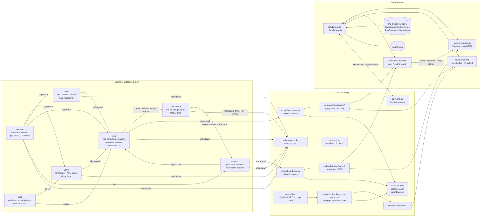
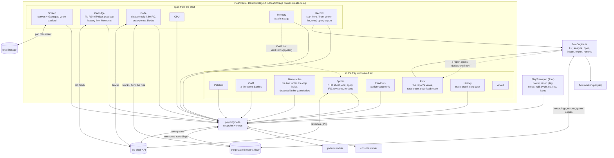
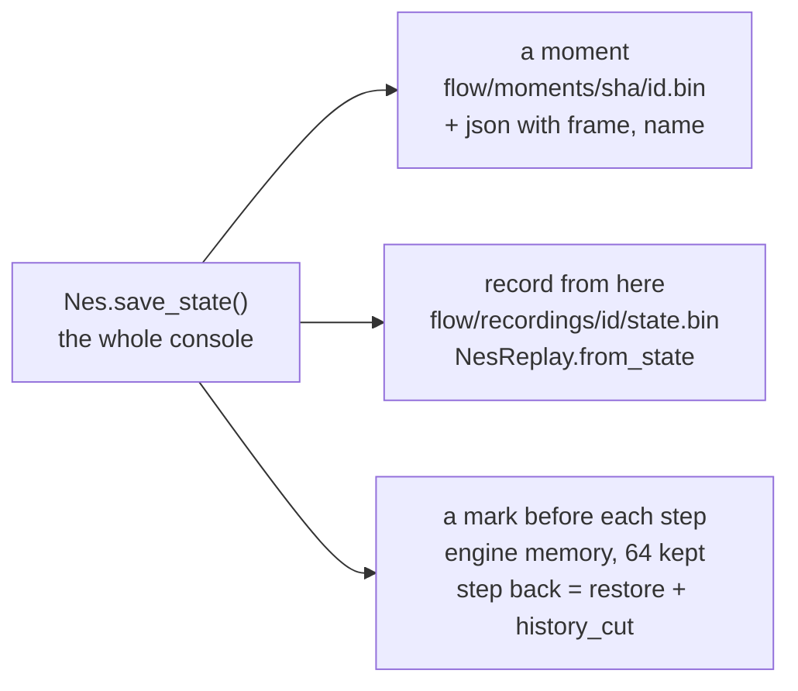
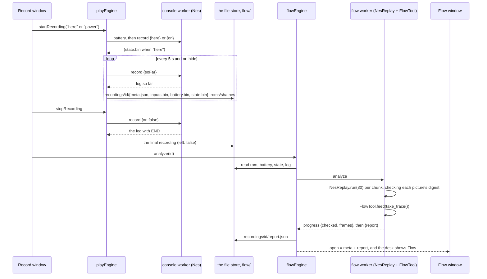
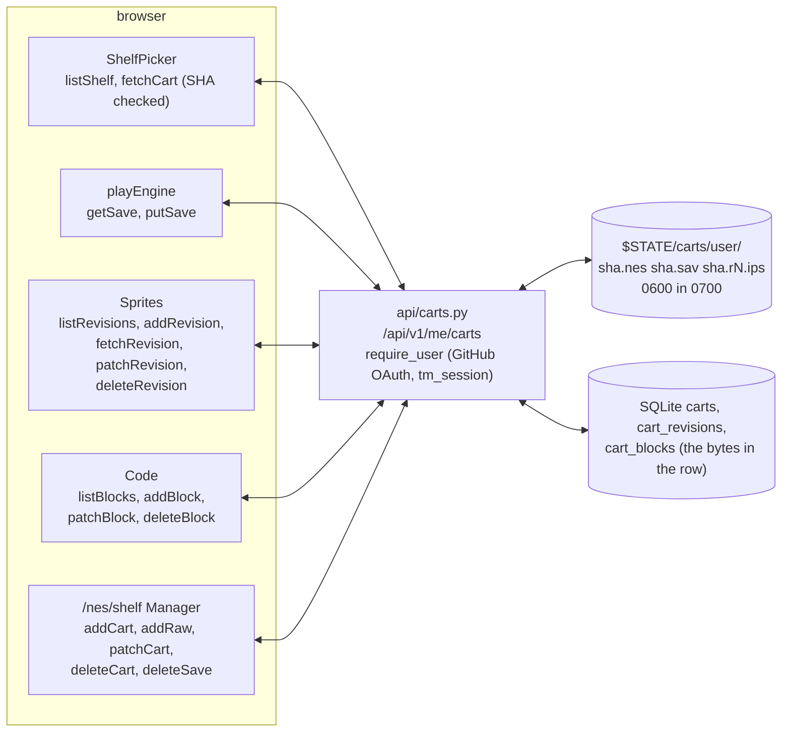
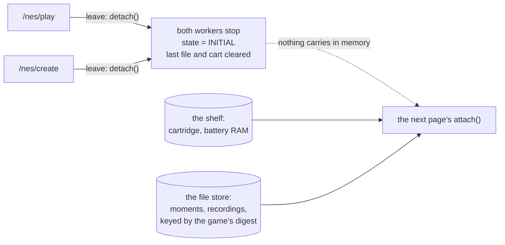

# The desk as built

*Version 1 of the create desk, read off the code as it stood on
2026-09-28: this site at 8e86ee7, nes ffa239e, nes-bus 707485a, 2a03
a7fa5f5, 2c02 c9fe9e8, ntsc-crt f91aecb and nes-bench 83f9175. Every
claim here was read in a file, not remembered. Where a file's own comment
disagreed with its code, the comment was fixed the same night and the
last sections say what was found.*

The desk is [/nes/create](/nes/create): the console from the play page
with every tool we have for looking inside a running game, each in a
window of its own. This page is the map to keep open while the desk's
ergonomics are redesigned. It says, for each window, what it reads, what
it does, where what it makes goes, and which of the other pieces it leans
on. Every drawing opens full screen from a press; the caption under each
says what it shows. The reports' working words are explained in
[Words the reports use](/docs/words); the desk's own words are at the end
of this page.

## The short version

- **One machine, many views.** Everything on [/nes/play](/nes/play) and
  [/nes/create](/nes/create) follows one module, `playEngine.ts`. It owns
  two workers: the console (the NES as WebAssembly) and the picture (the
  NTSC signal path, on the GPU when the browser offers one and its decode
  agrees, in WebAssembly otherwise). Every window subscribes to the
  engine's one snapshot and calls its verbs. No window talks to a worker
  directly.
- **A third worker, per job, for the flow tools.** `flowEngine.ts` starts
  a worker that plays a recording back and feeds the replay's trace to the
  flow analyser, then throws the worker away.
- **Four places things are kept, and nothing else.** The browser's own
  private file store holds recordings, their reports, one copy of each
  game, the moments, and the code blocks of a cartridge from the disk.
  The browser's local storage holds the desk's layout and the touch pad's
  placement. The shelf, behind a GitHub sign-in, holds cartridges, one
  battery save per cartridge, sprite revisions as patches, and the code
  blocks of a cartridge from there. Everything else, breakpoints, the
  history trace and the step-back marks, lives in memory and goes with the
  page.
- **No live handoff between Play and Create.** Both pages import the same
  engine, but leaving a page detaches it: both workers stop and the state
  resets. What carries over is what was saved: the shelf's cartridge and
  its battery RAM, and the moments and recordings in the file store, which
  are keyed by the game's digest and so find the same game again.

## Seven repositories, one page



The console is a family of Rust crates. `nes-bus` holds the contracts
they share: the dot frame, the pin frames, a cartridge with its boards.
`2a03` is the CPU and sound chip, `2c02` the picture chip, both built from
the transistor-level chips and checked against them. `ntsc-crt` is the
signal between the console and the television. `nes` puts the chips on
one board and, in `nes-wasm`, packs the whole console for a browser.
`nes-bench` is the real console on the bench, its bridge and its pads, and
the notebook you are reading. The crates reach each other by git tag or by
sibling path; the site reaches them only through three scripts that build
and record what they built, and one that pulls their documents.

Three things this drawing makes visible:

- **The console's bundle is not committed; the signal path's is.** The
  console bundle in `web/public/nes/wasm/` is derived from the die data
  and travels under its NonCommercial ShareAlike licence, so it is built on
  the host by `board-nes.py` and gitignored. The signal path's bundle
  embeds no chip data and is committed. The flow analyser in `wasm/flow`
  is ours, MIT, and reads only a trace.
- **The picture bundle is held to the console's pin.** The console pins
  `ntsc-crt` by tag (v0.2.18 at the time of writing), and the site serves
  the signal path's bundle boarded at that tag (`data/ntsc.json`,
  `bundle`). Two library tests in the deploy's first stage hold it there:
  one refuses a served bundle whose tag is not the console's pin, the
  other holds the served files to the record's digests. Until 2026-09-29
  the served bundle was six tags behind the pin and nothing said so.
- **The API knows cartridges, saves, revisions and code blocks, and
  nothing else.** Moments, recordings and reports never reach the server.
  A code block does only for a cartridge from the shelf, and only to
  that shelf, where the game already is.

### What each repository gives the page

| from | to | what, and in what form |
|---|---|---|
| nes-bus | 2a03, 2c02, nes, ntsc-crt | Rust types by git tag: `DotFrame`, pin frames, `Cartridge` with `prg_offset` and `CartState` |
| 6502 | 2a03, nes | `v6502-micro` and `v6502-pins` at one git revision, cross-checked by `board-nes.py` |
| 2a03, 2c02 | nes | crates by sibling path; die-data tables measured at build; saved states `RungState` and `Fast` |
| ntsc-crt | nes, 2c02 | crates by tag |
| nes | the site | `nes_wasm.js` and its `.wasm` by `board-nes.py --wasm` (gitignored); the test ROMs `bars`, `pad` and `pad-dmc`; figures in `data/nes.json`; digests held by the build check |
| ntsc-crt | the site | `ntsc_wasm.js` and its `.wasm` by `board-ntsc.py --wasm` (committed); `data/ntsc.json` |
| wasm/flow (here) | the site | `flow.js` and `flow_bg.wasm` by `build-playground-wasm.py`; `data/flow.json` |
| nes examples | nes-bench | `trace` output (`.pins`, `.stim`, `.events.json`, `.overlay`) read by `xray.py` and `dissect.py`; `pad-log` and bench-script output for `compare-logs.py` |
| nes-bench | ntsc-crt, nes | scope captures (`.u8` with a `.toml`) |
| every sibling | the site | markdown through `pull-nesdocs.mjs`; from nes-bench also the SVG sheets, the fab files, the drawing packages, the lab photographs and the keydown page at `/lab/pad-keydown` |

## The desk itself



### How the desk works

A window is dragged by its bar, sized from its corner, brought forward by
a press anywhere on it, filled to the desk by a double press on its bar,
and closed from its bar. The tray above the desk opens a closed window
again, and Tidy puts every window back where it started. A window's name
is its content's own heading, read after mount, so a panel is named in
one place and the tray follows it. The arrangement is kept in this
browser under one key, `tm.nes.create.desk`, as pixels, unclamped, one
record per window (`lib/desk.ts`):

```ts
type Win = { x: number; y: number; w: number; h: number; z: number; open: boolean; max: boolean };
// stored as { v: 2, wins: Record<string, Win> }, keyed by the window's id
```

The version is 2. Bumping it discards every stored arrangement, which is
how Record came to be open on every desk on 2026-09-27; Tidy removes the
key. A URL hash naming a window, `#record` say, opens and raises it, which
is how the strip's Record link lands on the desk.

On a phone, or any viewport narrower than 64rem or shorter than 36rem,
there is no desk: the same windows stand one under another with their own
headings and the strip under the bar maps them, as the play page does. It
is one tree either way, so crossing the breakpoint moves nothing. A
window's content is never unmounted, and a closed window is hidden rather
than removed, because the screen's canvas is what the console draws on
and a new canvas would stop the console.

### Where the windows start

| open from the start | in the tray until asked for |
|---|---|
| Screen (top left), Cartridge (under it), Code (the middle column), CPU and Memory (top right), Record (bottom right) | Palettes, OAM, Nametables, Sprites, Readouts, Flow (which opens over the screen and the code when a report arrives), History, About |

Record is open from the start so the way into the flow tools is on the
desk rather than in the tray (owner's call, 2026-09-27).

## Each window: what it consumes, produces and saves

The engine publishes one snapshot. A window reads the fields it needs and
calls the engine's verbs. "Engine state" below means the snapshot's
fields; the worker paths behind each verb are in the next section.

| window | consumes | produces (verbs) | saves | notes |
|---|---|---|---|---|
| **Screen** | the picture worker's bitmaps, painted by the engine into the canvas | `attach`, `detach`; the Gamepad's `setTouchPad(bits)`; keys handled in the engine | pad placement per orientation and haptics, localStorage `tm.nes.pad*` | the Gamepad shows only when the desk stacks (a phone); an off-screen input holds focus so a phone hands over the arrows |
| **Cartridge** | `loaded`, `loading`, `powered`, `running`, `battery`, `why`; the game's SHA-256, for what is kept under it (moments, recordings, the disk's blocks from the file store, the shelf's blocks from the shelf), counted again whenever either says it changed | `load(file, cart?)` from disk or the shelf; `toggleRun` | battery RAM to the shelf on a timer, on pause, on hide, and before another load; restored on load | contains **Moments**; the line says what is loading until the console answers, and what is kept for the game once it has |
| **Moments** (inside Cartridge) | the game's SHA-256, `momentsKept` | `saveMoment`, `loadMoment`, `deleteMoment` | the file store, `flow/moments/<sha>/<id>.bin` with a `.json` | a moment is the whole console (nes-console `state.rs`) with its frame count; Load is disabled while recording |
| **Code** | `machine.code`, `codeAt`, `cpu.pc`, `breakpoints`, `stoppedAt`, `cart`, the game's SHA-256; disassembles with the 6502 site's own table | `toggleBreakpoint`, `clearBreakpoints`; a captured block, its label and note | breakpoints: engine memory, sent with every tick; blocks: the shelf for a cartridge from there, the file store under the game's digest (`flow/blocks/<sha>/<id>.json`) for one from the disk, kept as captured and the words as the field is left either way; exported as markdown or JSON downloads | a block comes back with the cartridge from wherever it was kept; only a browser without the file store leaves a disk cartridge's blocks in the page, and the window says so |
| **CPU, Memory, Palettes, OAM** (one component, `State.tsx`) | `machine` (published every 200 ms while running), `palette` (the measured colours) | Memory: `watch(page)`; OAM: a tile button hands its tile to Sprites | none | four windows, one reader |
| **Nametables** | the nametable RAM and the pattern memory as the picture chip sees it, through the board's banks, asked of the worker (`nametables`) each time the machine is published while the window is on view; `ppu.ctrl` for the pattern table, palette RAM and the measured colours, `rom` for the header's mirroring | nothing | none | draws the two tables as the chip holds them, with the tiles the chip sees at that instant, whatever the board banks |
| **Sprites** | `base` (the parsed iNES image), `rom`, `patched`, `palette`, `machine.palette` (live), `cart`; on a board that draws from CHR-RAM, the console's pattern memory (`patternMemory`), asked with each publish while the sheet is on view | Apply (`reloadWith(image)`), Revert, download `.ips` or `.patched.nes`; Keep a revision, rename one, load one, delete one | edits: a Map in memory; revisions: the shelf, as IPS with a message | the only window that changes bytes; on a CHR-RAM board it only shows them |
| **Readouts** | frames, undecoded, per-frame costs, path, agreement, fps, drift, underruns, battery | nothing | none | read only |
| **Record** | play: `loaded`, `recording`, `powered`, `framesRun`, `recordingsKept`; flow: `list`, `busy`, `open`, `why` | `startRecording("here" or "power")`, `stopRecording`; per recording: `analyze` (Read), `open`, `exportOne` (`.nesrec`), `remove`, `cancel`, `giveRom`, `importOne` | recordings in the file store; a copy every 5 s while recording and on hide | the way into the flow tools; open on the desk from the start |
| **Flow** | `flow.snapshot().open` (the recording's meta and its parsed report) | the view (overview, modes, routines, loops, tables, pad, vars, raw); `saveTrace(from, to)` as `.trace`; `downloadReport` as `.flow.json` | nothing new; the report is already in the file store | brought forward when a report opens |
| **History** | `history`, `running`, `moves`, `backDepth`, `machine.code`; while paused, reads the trace bytes and parses them (`lib/history.ts`) | `setHistory(on)`, `stepBack` | the trace and the back stack in engine memory (the newest mebibyte of trace; 64 marks) | a step back restores a moment saved before each step and cuts the history to it |
| **PlayTransport** (the floor) | `powered`, `running`, `loaded` | `setPower`, `reset`, `toggleRun`; on Create also `step(half, cycle, op, line)` and `stepFrame` | none | rate and seek are always disabled, with the reason in their title |

A few of these deserve a sentence more than a cell.

**Screen** is the console attached to a canvas. The engine paints each
bitmap the picture worker sends; the window itself only owns the canvas
and, when the desk stacks, the touch pad. Keys are read by the engine at
the document, so any window can have focus and the pad still works.

**Cartridge** is the way a game gets in: a file from disk, or a cartridge
from the shelf. It also carries the battery line, which says whether the
board has battery RAM and when it was last kept, and the Moments list
under it. Battery RAM goes to the shelf on a timer while a cartridge with
a battery runs, when the console pauses, when the page is hidden, and
before another load; it comes back on load. A cartridge from disk keeps
its battery only for the page.

**Code** is the bus from the program counter, disassembled forward and lit
at the PC. Breakpoints live in the engine and travel with every tick, so
the console stops on them without asking the page. A block is a run of
the listing the reader selected, labelled and noted; it carries the
cartridge's digest, the range, the bytes and the text, so it can leave as
the encyclopedia's own shape or as JSON. For a cartridge from the shelf
it is kept there beside the revisions, the bytes with it, and comes back
when the cartridge is loaded from the shelf again; for a cartridge from
the disk it is kept in the browser's file store beside the game's
moments, under the game's digest, and comes back when the same file is
loaded again.

**Nametables** is the picture chip's own two kilobytes of nametable RAM,
drawn as the two tables the chip holds, with the game's tiles from the
pattern table the control register names and the four background
palettes. The board's mirroring decides which PPU addresses land on
which table: the header says it for a board whose mirroring is soldered,
and the window says so when the board switches it instead. The tiles
are the pattern memory as the chip sees it at that instant: the console
reads it through the board's banks as they stand and puts the board's
state back after every byte, because one board's read has a side effect
of its own (MMC2's latch trips on its trigger tiles). So a board that
banks its picture ROM draws with the bank on the bus, not the file's
first.

**Sprites** is the one window that changes bytes. An edit is a tile's
sixteen new bytes against the base image. The set can go into the console
as a patched image (the base stays the base, so the change survives a
power cycle), leave as an IPS patch or the whole patched image, or, for a
cartridge from the shelf, be kept there as a revision with a message. On
a board that draws from CHR-RAM the file carries no tiles, so the sheet
shows the console's pattern memory as the game has drawn it, following
the machine, and changes nothing: there is no base to patch.

**Record**, **Flow** and **History** are the desk's own tools, and the
next sections follow what they make.

## The seam between the page and the machine

The page talks to the console worker through a request and answer bridge:
`{id, path, ...}` in, `{id, ok, answer}` out. Every path, who calls it,
and the WebAssembly behind it (nes-wasm's `Nes`):

| path | called by | wasm | used by |
|---|---|---|---|
| `load` | `load`, power on, `reloadWith`, Record (from power) | `new Nes(bytes)` | Cartridge, Sprites, Record |
| `tick` (dt, pad, pad2, breakpoints) | the loop | `pacer.tick`, `run_frames`, `run_frames_until`, `frames_done` | Screen, Code |
| `state` | `refreshMachine` | `cpu_state`, `ppu_state`, `palette`, `oam`, `peek` | CPU, Memory, Palettes, OAM, Code |
| `watch` | `watch` | `peek` | Memory |
| `step` (kind) | `step` | `step_half_cycles`, `step_instruction`, `step_scanline` | the transport (Create) |
| `frame` | `stepFrame` | `run_frames(1)` | the transport (Create) |
| `reset`, `off` | `reset`, `setPower(false)` | `reset`; `record_stop` if recording | the transport |
| `battery` | `saveNow`, `load`, `startRecording` | `battery_ram`, `set_battery_ram`, `has_battery` | Cartridge, Record |
| `save`, `restore` | `saveMoment`, `loadMoment`, `stepBack` | `save_state`, `load_state` | Moments, History |
| `record` (here, soFar, on, off) | `startRecording`, `keepSoFar`, `stopRecording`, `detach` | `record_start_here`, `record_so_far`, `record_start`, `record_stop` | Record |
| `history`, `historyRead`, `mark`, `historyCut` | `setHistory`, `readHistoryBytes`, `markBack`, `stepBack` | `set_history`, `history`, `history_end`, `save_state`, `history_cut` | History |
| `ciram` | `nametables`, `patternMemory` | `ciram`, `chr` | Nametables, Sprites |

One tick is in flight at a time, so the time each display callback
reports is the true cost of the one before; the drift policy that decides
how many frames a tick owes is the signal path's own `Pipeline`, used here
as the pacer and pushing no frame, so the rule is the repository's and
never restated. `load` builds a console from the bytes on one of the
boards the console has, seven at the time of writing, and refuses
anything else by name. The game never leaves the browser.

The picture worker takes `frame` (the colour, emphasis and parity planes
of the newest frame) and answers a bitmap, which path drew it and the
agreement figures; its `palette` path answers the 64 colours as this
worker measured them, which Palettes and Sprites paint with. A frame the
console produced while the picture was busy is replaced by the next and
counted as undecoded, so the console never waits for the picture and the
sound never stalls for it.

The flow worker takes `analyze` (the game, the battery RAM, the saved
state, the input log and the program's length) and `trace` (the same with
a frame range, capped at 320 pictures).

## One saved state, three uses

`save_state` returns an 8-byte digest of the game and then the whole
console: a magic (`TMNESSTA`), a version, then the CPU, the PPU, the
board, the cartridge's registers and RAM, the timing and the sound.
`load_state` refuses another game's state and refuses while recording.
The same bytes are three things on the desk:



## A recording, end to end



The formats that cross here are the console's, defined once in the nes
repository's `record.rs` and mirrored in the browser:

- **The input log**, 16 bytes per event (a pad change, a reset, a frame's
  digest, the end), applied when the master clock matches. The log is the
  whole recording, because the console is deterministic from power-on: the
  same bytes and the same presses give the same frames, and the digests
  prove it on replay.
- **The trace**, 8 bytes per record (a CPU cycle with its program offset,
  the registers after each opcode fetch, an input, a frame), which the flow
  analyser reads and History parses (`lib/history.ts`).
- **The report**, JSON from `FlowTool.report()`: sites keyed by program
  offset, routines by kind, loops, variables, dispatch tables, modes, what
  followed the pad, and a per-frame timeline. `flowEngine.ts` carries the
  matching TypeScript type.
- **The export**, `.nesrec`: a magic, then length-prefixed meta, battery,
  log and state. It never includes the game. A recording whose game is
  missing asks for it (Record's "give ROM", from disk or the shelf) and
  checks its digest.

A recording made from where the game stands starts from the whole console
saved at that instant, kept beside the log as `state.bin`; the replay
loads that state first (`NesReplay.from_state`) and then applies the log.

## The shelf



The limits are the API's, read from its constants and its environment: a
name of 80 characters and a note of 240; a battery save of 32 KiB; 16
revisions per cartridge; 64 code blocks per cartridge, each 4 KiB at
most; a cartridge of 4 MiB plus its header and trainer; and 32 places
per account, which an admin resizes and zero closes. A revision is an
IPS patch against the base image; the patched image is built on request
and never stored. A block is its range, the bytes that were on the bus
and two strings; its listing is disassembled from the bytes wherever it
is shown and never stored. The window event `tm:shelf-changed` refreshes
every picker after a write.

## What is kept where, and what survives

| where | what | keyed by | survives a reload | survives leaving the page | another browser, another machine |
|---|---|---|---|---|---|
| the browser's private file store | recordings and their reports, one copy of each game, moments, the code blocks of a cartridge from the disk | recording id; the game's SHA-256 | yes | yes | no: this browser only, and clearing site data removes it |
| localStorage | the desk's layout, the touch pad's placement and haptics | fixed keys | yes | yes | no |
| the shelf, signed in with GitHub | cartridges, one battery save per cartridge, sprite revisions as IPS, code blocks | the account and the cartridge id | yes | yes | yes, signed in |
| memory | breakpoints, the history trace, the 64 step-back marks | nothing | no | no | no |

Two consequences for anyone redesigning the desk. A game's moments,
recordings and (from the disk) code blocks are already indexed by its
digest, so the cartridge line says what is kept for a game the moment
it loads, on either page, and again at every change (`Held.tsx`, since
2026-09-29). And since 2026-09-29 everything written on the
desk is kept somewhere: code blocks live in two places, the shelf for a
cartridge from there and the file store for one from the disk, and a
block never crosses between them, because each is asked for by the
cartridge it was read on.

## Leaving a page



Detach stops the recording if one is running (`record_stop`), stops both
workers and resets the engine to its first state, clearing the last file
and cartridge. It announces nothing, because the only followers are the
sections leaving with the page, and the next attach starts from the fresh
snapshot. Record, Flow and History exist only on Create, while Play's
engine carries their state and never exercises it.

## What crosses each boundary

| from | to | what, and how |
|---|---|---|
| console worker | picture worker | the colour, emphasis and parity planes; a bitmap back |
| console worker | the file store | the input log, the saved state, battery RAM |
| flow worker | the file store | the report JSON |
| the page | the API | HTTP with the session cookie: the game's bytes, a `.sav`, an IPS, a code block (its range, its bytes and its words) |
| the engine | localStorage | the desk's layout; the pad's placement |
| the desk | downloads | a block as markdown or JSON; a recording as `.nesrec`; a trace; a report; an IPS or a patched image |

Nothing crosses that is not in this table. In particular no key and no
trace reaches the server; a code block does only for a cartridge from
the shelf, and only to that shelf; and the game's bytes go up only to
the reader's own shelf.

## What the survey found behind the code

Reading every window against its own comments turned up eleven places
where the words were behind the code. None was a behaviour; each was a
comment or a line of copy written against an earlier desk. All eleven
were corrected on 2026-09-28, and the list stays here as the record of
what a survey of a system's own words catches:

1. The create page's about text said a moment could not yet be saved on
   its own and that breakpoints were not there yet. Both were on the desk.
2. The transport's seek title said nothing could be rewound; History
   steps back.
3. The Sprites header said palette RAM could not be read from this
   bundle; the component reads it.
4. The console worker's header listed three of the sixteen paths it
   answers, and said a recording could start only at power-on; one can
   start mid-game. Its `ciram` path had no caller (it has one since
   2026-09-29: the Nametables window).
5. The picture worker's header omitted its `palette` path.
6. The file store's header omitted `state.bin` and the moments.
7. The Record header said "from power-on" only.
8. `shelf.patchRevision` had no caller (it has one since 2026-09-29:
   Rename, in Sprites).
9. `detach()` resets the engine's state without telling its followers,
   which is harmless for the reason given above; it now says so.
10. `lib/nes-shelves.ts` is the notebook's document shelves, not the
    cartridge shelf; both files now say which is which.
11. Record, Flow and History exist only on Create while Play's engine
    carries their state; the engine's header now says so.

## What the survey found missing, and what arrived

The survey of 2026-09-28 found four things not on the desk. All four
arrived on 2026-09-29, and the rest of this document describes the desk
with them on it:

- **Code blocks are kept.** For a cartridge from the shelf they go to
  the shelf beside the revisions, as the window itself said they should,
  and come back with the cartridge. Blocks of a cartridge from the disk
  go to the browser's file store beside the game's moments, under its
  digest, and come back when the same file is loaded again. Only a
  browser without that store leaves them in the page, and the window
  says so.
- **The nametables have a window.** Nametables asks the console worker's
  `ciram` path, which had no caller, and draws the two tables the chip
  holds.
- **A revision can be re-described.** Rename, in Sprites, calls
  `shelf.patchRevision`, which no window had called.
- **The picture bundle is at the console's pin**, boarded at the tag
  the console names, and a library test in the deploy refuses a served
  bundle at any other tag.

## What this means for the ergonomics work

Facts the redesign can lean on, because they are structural rather than
cosmetic:

- **Every window is a view of one snapshot.** Moving, merging or
  splitting windows costs nothing in the engine; a new window is a new
  reader of fields that are already published. The desk's only per-window
  state is its rectangle.
- **The desk's own persistence is one key.** The layout is `{v, wins}` in
  pixels under `tm.nes.create.desk`; a version bump discards it and Tidy
  removes it. A URL hash opens and raises a window.
- **Nothing is waiting for a home.** The three things the survey found
  waiting (code blocks in React state, the `ciram` export with no view,
  `patchRevision` with no caller) each have one since 2026-09-29: the
  shelf, the Nametables window, Rename in Sprites.
- **Three things are already keyed by the game's digest** and so follow a
  game from Play to Create and back: moments, recordings, and the code
  blocks of a cartridge from the disk. The cartridge line counts them
  the moment a game loads.
- **The bytes only change in Sprites.** Every other window reads. An
  "edited" state for the whole desk is Sprites' edit Map plus the
  engine's `patched` flag, nothing more.

## The desk's words

- **A moment**: the whole console saved at one instant, with its frame
  count and a name. Kept in the file store under the game's digest.
- **A recording**: the input log of one run, from power-on or from a
  moment, with the digest of every picture. The log is the run, because
  the console is deterministic.
- **A report**: what the flow analyser read off a recording's replay:
  routines, loops, tables, modes, what followed the pad.
- **The trace**: the console's own record of each CPU cycle, instruction,
  input and frame, 8 bytes each. History reads the newest of it; the flow
  analyser reads all of a replay's.
- **Battery RAM**: the cartridge's own save memory, on boards that have
  one. Kept on the shelf, one per cartridge.
- **A revision**: an edit to a cartridge's tiles, kept on the shelf as an
  IPS patch with a message. The base image is never changed.
- **A block**: a run of the code listing the reader selected and
  described, with the bytes that were on the bus. Kept on the shelf for a
  cartridge from there; its listing is read from its bytes again wherever
  it is shown.
- **A nametable**: one screen of tile numbers and their palettes, as the
  picture chip holds it. The chip's RAM holds two; the board's mirroring
  says which PPU addresses land on which.
- **A board**: the cartridge's circuit, which decides how the console
  reads it. The console has seven and refuses the rest by name.
- **The picture worker**: the signal path from the console's dots to a
  bitmap, on the GPU or in WebAssembly, on its own thread.
- **The file store**: the browser's Origin Private File System, where a
  web page keeps files of its own. Never sent anywhere.

*Written in this repository, not pulled: the desk is ours. The rest of
this notebook is pulled from the sibling repositories at build time.*
