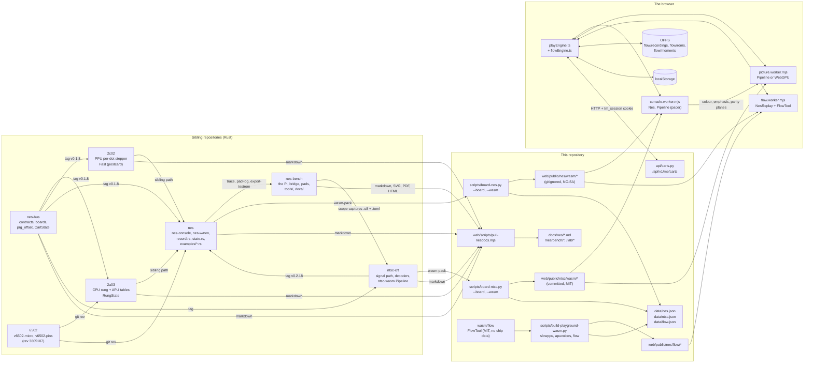
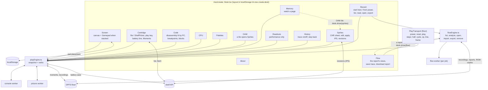
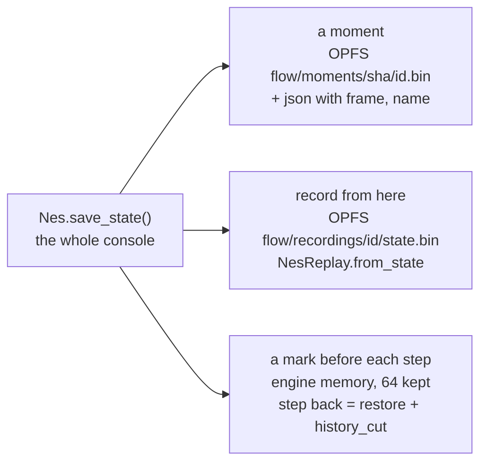
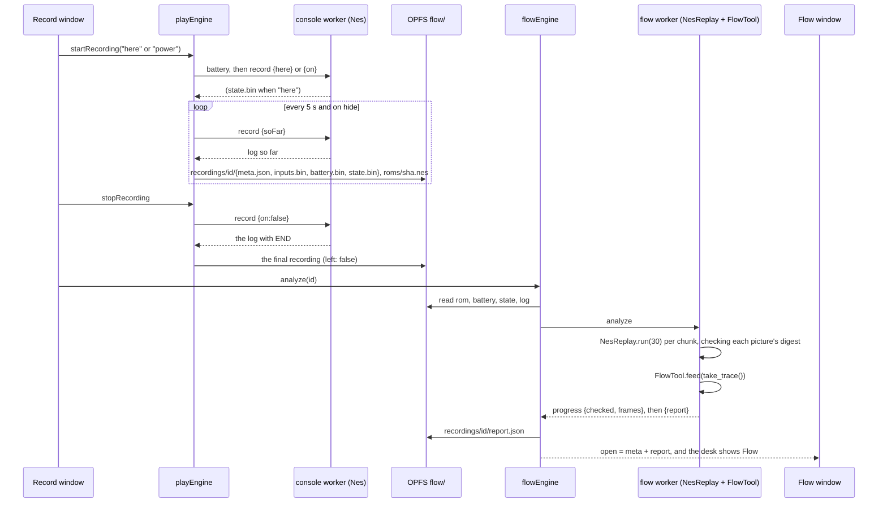
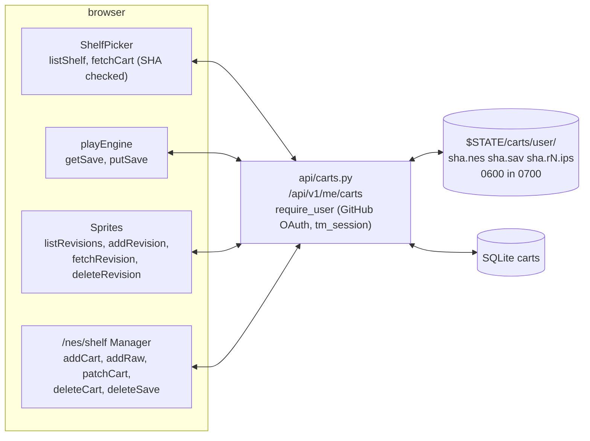

# The workbench map: what talks to what

Written 2026-09-28 from two read-only surveys of the code as it stands
(the site at 8e86ee7, nes 595dcf6, nes-bus 707485a, 2a03 a7fa5f5,
2c02 c9fe9e8, ntsc-crt f91aecb, nes-bench 83f9175). Every claim below
was read in a file, not recalled; where a file's own comment disagrees
with its code, the last section says so. This is the map to have open
while the desk's ergonomics are redesigned: it says, for each window,
what it consumes, what it produces, where that goes, and which of the
other pieces it depends on.

`notes/workbench.md` is the 2026-09-22 inventory (what exists, what is
missing) and `notes/modules.md` maps every module edge out of the
repository. This note sits between them: the running system, as wired.

## The short version

- **One engine, many views.** Everything on `/nes/play` and `/nes/create`
  follows one module, `web/app/[lang]/nes/play/playEngine.ts`. It owns
  two workers: the console (the NES as wasm) and the picture (the NTSC
  signal path, on WebGPU when the browser has it, wasm otherwise). Every
  window subscribes to the engine's snapshot and calls its verbs; no
  window talks to a worker directly.
- **A third worker per job** for the flow tools: `flowEngine.ts` spawns
  a flow worker that replays a recording and feeds the replay's trace to
  the flow analyser, then throws the worker away.
- **Four places things persist**, and nothing else:

| where | what | keyed by |
|---|---|---|
| the browser's private file store (OPFS) | recordings, their reports, one copy of each ROM, moments | recording id; ROM SHA-256 |
| localStorage | the desk layout, the touch pad's placement and haptics | fixed keys |
| the shelf API, signed in with GitHub | cartridges, one battery save per cartridge, sprite revisions as IPS patches | account, cartridge id |
| memory only | code blocks, breakpoints, the history trace, the step-back stack | gone with the page |

- **No live handoff between Play and Create.** Both pages import the same
  engine module, but leaving a page detaches it: both workers stop and
  the state resets. What carries over is what was saved: the shelf's
  cartridge and battery RAM, and the moments and recordings in OPFS.

## The whole system

Two things this picture makes visible:

- **The picture bundle is behind the console's pin.** The console pins
  ntsc-crt at tag v0.2.18; the site serves the ntsc bundle boarded at
  35b01e4, which is v0.2.12 (`data/ntsc.json`, `bundle`). check-build
  holds the console bundle to its record and, as far as a grep found,
  not the ntsc bundle.
- **The API knows cartridges, saves and revisions, and nothing else.**
  Moments, recordings, reports and code blocks never reach the server.

## The desk

### Each window: consumes, produces, saves

The engine publishes one snapshot; a window reads the fields it needs
and calls the engine's verbs. "Engine state" below means the snapshot's
fields; the worker paths and wasm calls behind each verb are in the
next section.

| window | consumes | produces (verbs) | saves | notes |
|---|---|---|---|---|
| **Screen** | the picture worker's bitmaps, painted by the engine into the canvas | `attach`, `detach`; the Gamepad's `setTouchPad(bits)`; keys handled in the engine | pad placement per orientation and haptics, localStorage `tm.nes.pad*` | the Gamepad shows only when the desk stacks (phone); an off-screen input holds focus so a phone hands over the arrows (a3e2bf1) |
| **Cartridge** | `loaded`, `powered`, `running`, `battery`, `why` | `load(file, cart?)` from disk or the shelf; `toggleRun` | battery RAM to the shelf on a timer, on pause, on hide, before another load; restored on load | contains **Moments** |
| **Moments** (inside Cartridge) | the ROM's SHA-256, `momentsKept` | `saveMoment`, `loadMoment`, `deleteMoment` | OPFS `flow/moments/<sha>/<id>.bin` + `.json` | a moment is the whole console (nes-console `state.rs`) with the frame count; Load is disabled while recording |
| **Code** | `machine.code`, `codeAt`, `cpu.pc`, `breakpoints`, `stoppedAt`, `cart.sha256`; disassembles with `public/6502/games/disasm.js` | `toggleBreakpoint`, `clearBreakpoints`; a captured block | breakpoints: engine memory, sent with every tick; blocks: React state, export as markdown or JSON downloads | **blocks are lost on leaving the page**; the UI says the shelf is the next step |
| **CPU / Memory / Palettes / OAM** (one component, `State.tsx`) | `machine` (published every 200 ms while running), `palette` (the measured colours) | Memory: `watch(page)`; OAM: a tile button hands its tile to Sprites | none | four windows, one reader |
| **Sprites** | `base` (parsed iNES), `rom`, `patched`, `palette`, `machine.palette` (live), `cart` | Apply (`reloadWith(image)`), Revert, download `.ips` or `.patched.nes`; Keep a revision, load one, delete one | edits: a Map in memory; revisions: the shelf, as IPS with a message | the only window that changes bytes |
| **Readouts** | frames, undecoded, per-frame costs, path, agreement, fps, drift, underruns, battery | nothing | none | read-only |
| **Record** | play: `loaded`, `recording`, `powered`, `framesRun`, `recordingsKept`; flow: `list`, `busy`, `open`, `why` | `startRecording("here" or "power")`, `stopRecording`; per recording: `analyze` (Read), `open`, `exportOne` (`.nesrec`), `remove`, `cancel`, `giveRom`, `importOne` | recordings in OPFS; a copy every 5 s while recording and on hide (`left: true`) | the way into the flow tools; open on the desk from the start |
| **Flow** | `flow.snapshot().open` (meta + parsed report) | view choice (overview, modes, routines, loops, tables, pad, vars, raw); `saveTrace(from, to)` as `.trace`; `downloadReport` as `.flow.json` | nothing new; the report is already in OPFS | brought forward when a report opens |
| **History** | `history`, `running`, `moves`, `backDepth`, `machine.code`; while paused reads the trace bytes and parses them (`lib/history.ts`) | `setHistory(on)`, `stepBack` | trace and back stack in engine memory (the newest megabyte; 64 marks) | step back restores a moment saved before each step and cuts the history to it |
| **PlayTransport** (floor) | `powered`, `running`, `loaded` | `setPower`, `reset`, `toggleRun`; on Create also `step(half, cycle, op, line)` and `stepFrame` | none | rate and seek are always disabled |

## The engine's seam: what each verb asks the workers

The page talks to the console worker through a request/answer bridge
(`{id, path, ...}` in, `{id, ok, answer}` out). Every path, who calls
it, and the wasm behind it:

| path | called by | wasm (nes-wasm `Nes`) | used by |
|---|---|---|---|
| `load` | `load`, power on, `reloadWith`, Record (from power) | `new Nes(bytes)` | Cartridge, Sprites, Record |
| `tick` (dt, pad, pad2, breakpoints) | the loop | `pacer.tick`, `run_frames`, `run_frames_until`, `frames_done` | Screen, Code |
| `state` | `refreshMachine` | `cpu_state`, `ppu_state`, `palette`, `oam`, `peek` | CPU, Memory, Palettes, OAM, Code |
| `watch` | `watch` | `peek` | Memory |
| `step` (kind) | `step` | `step_half_cycles`, `step_instruction`, `step_scanline` | transport (Create) |
| `frame` | `stepFrame` | `run_frames(1)` | transport (Create) |
| `reset`, `off` | `reset`, `setPower(false)` | `reset`; `record_stop` if recording | transport |
| `battery` | `saveNow`, `load`, `startRecording` | `battery_ram`, `set_battery_ram`, `has_battery` | Cartridge, Record |
| `save`, `restore` | `saveMoment`, `loadMoment`, `stepBack` | `save_state`, `load_state` | Moments, History |
| `record` (here / soFar / on / off) | `startRecording`, `keepSoFar`, `stopRecording`, `detach` | `record_start_here`, `record_so_far`, `record_start`, `record_stop` | Record |
| `history`, `historyRead`, `mark`, `historyCut` | `setHistory`, `readHistoryBytes`, `markBack`, `stepBack` | `set_history`, `history`, `history_end`, `save_state`, `history_cut` | History |
| `ciram` | **nobody** | `ciram`, `chr_ram` | a nametable or CHR-RAM view has its export waiting |

The picture worker takes `frame` (colour, emphasis, parity) and answers
a bitmap plus which path drew it and the agreement figures; `palette`
answers the 64 measured colours that Palettes and Sprites paint with.

The flow worker takes `analyze` (rom, battery, state, log, prgLen) and
`trace` (the same plus a frame range, capped at 320 pictures).

## One saved state, three uses

`save_state` returns an 8-byte ROM digest and then the whole console
(`TMNESSTA`, version, postcard of CPU, PPU, board, cartridge registers
and RAM, timing, sound). `load_state` refuses another ROM's state and
refuses while recording. The same bytes are:

## A recording, end to end

The formats that cross here are the console's, defined once in nes
`record.rs` and mirrored in the browser:

- **the input log**, 16 bytes per event (pad, reset, frame digest, end),
  applied when the master clock matches; the log is the whole recording
  because the console is deterministic from power-on;
- **the trace**, 8 bytes per record (a CPU cycle with its PRG offset, the
  registers after each opcode fetch, an input, a frame), which the flow
  analyser reads and History parses (`lib/history.ts`);
- **the report**, JSON from `FlowTool.report()`: sites keyed by PRG
  offset, routines by kind, loops, variables, dispatch tables, modes,
  input correlations, a per-frame timeline. `flowEngine.ts` carries the
  matching TypeScript type.
- **the export**, `.nesrec`: a magic, then length-prefixed meta, battery,
  log and state. It never includes the ROM; a recording whose ROM is
  missing asks for it (Record's "give ROM", from disk or the shelf).

## The shelf

Limits are the API's, read from its constants and environment: a name
of 80 characters and a note of 240, a save of 32 KiB, 16 revisions per
cartridge, a cartridge of 4 MiB plus header, 32 cartridges per account
(an admin resizes; zero closes the shelf). A revision is an IPS patch
against the base; the patched image is built on request and never
stored. The `tm:shelf-changed` window event refreshes every picker
after a write.

## What crosses each boundary, and in what form

| from | to | what, and how |
|---|---|---|
| nes-bus | 2a03, 2c02, nes, ntsc-crt | Rust types by git tag: `DotFrame`, pin frames, `Cartridge` with `prg_offset` and `CartState` |
| 6502 | 2a03, nes | `v6502-micro`, `v6502-pins` at one git revision, cross-checked by `board-nes.py` |
| 2a03, 2c02 | nes | crates by sibling path; die-data tables measured at build; saved states `RungState` and `Fast` |
| ntsc-crt | nes, 2c02 | crates by tag |
| nes | the site | `nes_wasm.js` + `.wasm` by `board-nes.py --wasm` (gitignored, NC-SA); test ROMs `bars`, `pad`, `pad-dmc`; figures in `data/nes.json`; hashes held by check-build |
| ntsc-crt | the site | `ntsc_wasm.js` + `.wasm` by `board-ntsc.py --wasm` (committed, MIT); `data/ntsc.json` |
| wasm/flow (here) | the site | `flow.js` + `flow_bg.wasm` by `build-playground-wasm.py`; `data/flow.json` |
| console worker | picture worker | the colour, emphasis and parity planes; a bitmap back |
| console worker | OPFS | the input log, the saved state, battery RAM |
| flow worker | OPFS | the report JSON |
| browser | API | HTTP with the session cookie: ROM bytes, `.sav`, IPS |
| nes examples | nes-bench | `trace` output (`.pins`, `.stim`, `.events.json`, `.overlay`) read by `xray.py` and `dissect.py`; `pad-log` and `bench-script` output for `compare-logs.py` |
| nes-bench | ntsc-crt, nes | scope captures (`.u8` + `.toml`) |
| every sibling | the site | markdown through `pull-nesdocs.mjs`; from nes-bench also SVG sheets, fab files, the drawing packages, lab photos and the keydown page at `/lab/pad-keydown` |

## Where the code's own words are behind the code

Found on the way; each is a comment or a line of copy, not a behaviour.
Cleared the same night, on the owner's word; the list stays as the record
of what a survey of the code's own words catches.

1. `create/page.tsx` still says saving a moment on its own and
   breakpoints "are not here yet". Both are on the desk.
2. `PlayTransport.tsx`'s seek title says nothing can be rewound; History
   steps back.
3. `Sprites.tsx`'s header says palette RAM cannot be read from this
   bundle; the component reads `machine.palette`.
4. `console.worker.mjs`'s header lists three paths of the sixteen it
   answers, and says a recording can start only at power-on; `record
   {here}` starts one mid-game. Its `ciram` path has no caller.
5. `picture.worker.mjs`'s header omits the `palette` path.
6. `flowStore.ts`'s header layout omits `state.bin` and the `moments/`
   tree.
7. `Record.tsx`'s header says "from power-on"; it also records from here.
8. `shelf.patchRevision` has no caller.
9. `detach()` resets the engine's state without notifying subscribers.
   Harmless, because the only followers are the sections leaving with
   the page; it now says so. (A first draft of this note said it also
   left the last file and cart set; it does not, it clears them.)
10. `lib/nes-shelves.ts` is the documents' shelves, not the cartridge
    shelf; the name invites the confusion.
11. Record, Flow and History exist only on Create, while Play's engine
    still carries their state.

## What this means for the ergonomics work

Facts the redesign can lean on, because they are structural rather than
cosmetic:

- **Every window is a view of one snapshot.** Moving, merging or
  splitting windows costs nothing in the engine; a new window is a new
  reader of fields that are already published. The desk's only per-window
  state is its rectangle, in localStorage.
- **The desk's own persistence is one key.** Layout is `{v: 2, wins}` in
  pixels, unclamped, under `tm.nes.create.desk`; a version bump discards
  it and Tidy removes it. A URL hash `#<id>` opens and raises a window,
  which is how the strip's "Record" link lands on the desk.
- **Three things are waiting for a home.** Code blocks live in React
  state; the `ciram` export has no view; `patchRevision` has no caller.
  A "keep" gesture for blocks would be the first thing on the desk that
  is written but never saved.
- **Two things are already keyed by the ROM's digest** and so follow a
  game from Play to Create and back: moments and recordings. A design
  that shows "what you have for this game" has its index already.
- **The bytes only change in Sprites.** Every other window reads. If the
  redesign wants an "edited" state for the whole desk, it is Sprites'
  edit Map plus the engine's `patched` flag, nothing more.
